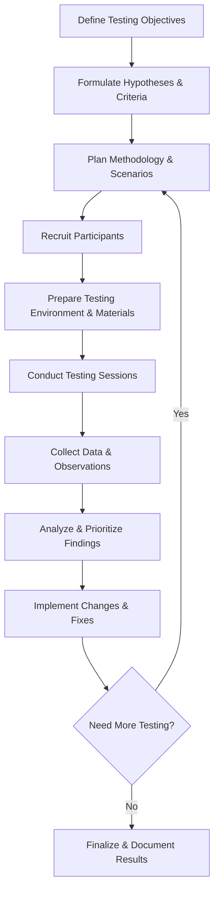
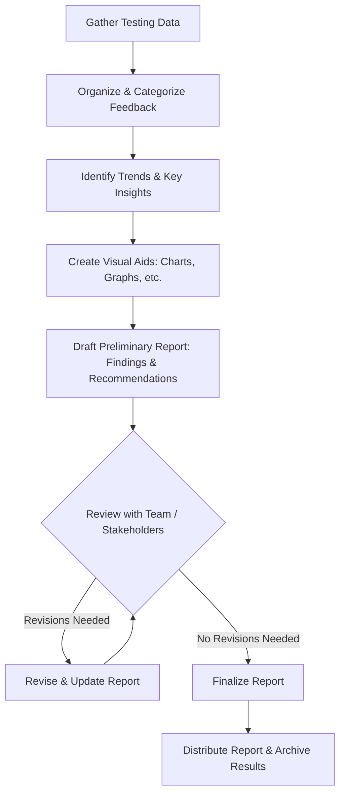

# User-Testing for Game Development

---

## Introduction & Objectives
- **Purpose of User Testing**
  - Helps identify and fix usability issues
  - Improves overall player satisfaction and retention
- **Session Objectives**
  - Understand why testing is crucial for final-year projects
  - Learn how to plan and execute effective user testing sessions
  - Recognize how real-world examples connect to their own work
- **Real-World / Past Project Example**
  - A student team discovered a difficulty spike in their puzzle game, adjusted levels based on feedback, and significantly improved player engagement

<!-- speaker: Welcome, everyone! Today, we’re diving into user testing and why it’s so important for your final-year game projects. Testing isn’t just about fixing bugs—it’s about refining the player experience and making sure your game is the best it can be. We’ll cover everything from planning tests to analyzing feedback, with some real-world and student examples to bring it all together. Let’s get started! -->

---

## Why User Testing Matters
- **Pitfalls of Skipping Testing**
  - Players encounter frustrating bugs or confusing controls
  - Last-minute fixes become more costly and time-consuming
- **Impact on Game Quality**
  - Better balance, pacing, and player enjoyment
  - Drives positive word-of-mouth and builds confidence in your project
- **Professional & Past Examples**
  - Major studios run alpha/beta tests to polish mechanics and squash bugs
  - Former students improved level design after discovering that testers found gameplay too complex
- **Testing in the Development Cycle**
  - Feedback → Fix → Retest → Polished Experience

<!-- speaker: So, why does user testing matter? Well, imagine launching your game without ever letting someone outside your team play it. What happens? Players get confused, bugs appear, and fixing them at the last minute becomes a nightmare. Testing early helps you fine-tune the experience and catch those problems before they ruin your launch. Game companies do it, and so should you! -->

---

## Types of User Testing
- **Usability Testing**
  - Examines interface clarity, menu navigation, and control schemes
  - Often employs direct observation or “think-aloud” protocols
- **Playtesting**
  - Focuses on game mechanics, pacing, difficulty, and fun factor
  - Involves multiple rounds to gradually refine gameplay
- **Remote vs. In-Person**
  - Remote: convenient, potentially larger sample size but less direct observation
  - In-Person: richer feedback, body language cues, easier to clarify issues
- **Quantitative vs. Qualitative**
  - Quantitative: metrics like completion times, error rates
  - Qualitative: interviews, open-ended feedback on player experience
- **Exploratory Testing**
  - Players engage without structured tasks to discover unexpected usability issues

<!-- speaker: There are different ways to approach testing. If you want to know if your menu system is intuitive, usability testing is the way to go. If you’re more concerned with whether your game is fun and balanced, then playtesting is your best bet. And remember—numbers and stats are useful, but listening to what testers actually say can reveal insights that raw data won’t. -->

---

## Planning & Logistics
- **Define Goals & Hypotheses**
  - What specific questions need answers? (e.g., “Is the difficulty balanced?”)
  - Set measurable criteria for success or failure
- **Recruit Participants**
  - Aim for a diverse pool representing different skill levels and backgrounds
  - Consider accessibility needs (e.g., color blindness, mobility issues)
  - Utilize remote playtesting tools (PlaytestCloud, Steam Playtest, Discord groups)
- **Test Environment**
  - Stable build, consistent hardware/software, minimal distractions
  - Ensure cross-platform consistency (PC, console, mobile testing)
- **Team Roles**
  - Facilitator: guides the session
  - Observer: watches player behavior, takes notes
  - Note-Taker: captures detailed feedback and time stamps

<!-- speaker: Before you start testing, you need a plan. What are you looking to find out? Who will you test with? How will you document their feedback? Good preparation ensures that your testing sessions go smoothly and give you meaningful results. Make sure your game build is stable, and think about accessibility—your testers may have different abilities and backgrounds! -->

---

## Ethical & Practical Considerations
- **User Well-Being**
  - Avoid sessions that are too long or stressful
  - Provide breaks, ensure clear communication of what's expected
- **Bias & Conflicts of Interest**
  - Stay neutral when guiding testers; don’t prompt “right answers”
  - Invite testers who aren’t just friends and family for more honest feedback
- **Data Privacy**
  - Don’t share personal info or data outside the team
  - If recording sessions, get explicit permission
- **Accessibility Considerations**
  - Test for colorblind-friendly UI, adjustable controls, and subtitles for hearing-impaired players
  - Consider usability for players with mobility constraints

<!-- speaker: Finally, always be ethical about testing. Don’t make sessions too long or stressful, and respect your testers’ privacy. Keep things fair by avoiding bias—if all your testers are just friends, you might not get the honest feedback you need. And don’t forget accessibility—your game should be enjoyable for as many people as possible! -->

---

## Test Execution
- **Materials & Scripts**  
  - Structured test plan (tasks, questions)  
  - Script to welcome users and explain each step  
- **Facilitation & Observation**  
  - Keep instructions clear and avoid influencing the player’s actions  
  - Observe body language and immediate reactions  
- **Pitfalls**  
  - Technical issues (crashes, slow load times)  
  - Leading questions or biased remarks during testing  
- **Ethical Considerations**  
  - Informed consent forms if needed  
  - Ensure testers feel comfortable and free to give honest feedback

<!-- speaker: When you begin the session, explain what testers should expect. Use a script so each participant follows a similar set of tasks—this helps you compare notes across sessions. Watch out for subtle cues—if a tester looks confused but doesn’t say it, that’s still valuable feedback. Make sure you have a plan to handle any unexpected glitches or bugs so the tester’s experience doesn’t derail completely. -->

---

## Data Collection & Metrics
- **Quantitative Metrics**  
  - Time-on-task, error counts, success/failure rates  
  - Track performance across multiple sessions to see patterns  
- **Qualitative Feedback**  
  - Think-aloud comments, post-test interviews, open-ended surveys  
  - Capture emotional responses and overall satisfaction  
- **Templates & Tools**  
  - Observation sheets or checklists  
  - Spreadsheet logs or specialized testing software  
- **Consistency**  
  - Standardized methods ensure reliable comparisons between sessions

<!-- speaker: Make a checklist of what you’ll track—maybe how long it takes players to beat level one, how many times they fail, or if they mention frustration. Quantitative data is great for spotting trends, while qualitative data tells you why those trends exist. Templates and consistency keep everything organized and easier to review later. -->

---

## Analysis & Interpretation
- **Organizing Raw Data**  
  - Affinity diagrams or thematic coding to group feedback  
  - Spreadsheets to compare metrics across testers  
- **Identifying Trends**  
  - Look for recurring comments or frequent stumbling points  
  - Note how different player types experience the game  
- **Prioritizing Findings**  
  - Use simple frameworks (e.g., MoSCoW)  
  - Focus first on critical bugs or design flaws  
- **Linking Data to Design Decisions**  
  - Map user feedback to changes in UI, mechanics, or difficulty levels

<!-- speaker: Once testing is done, you’ll have a heap of data. Start by grouping similar comments or issues—maybe many players mentioned your camera controls. That’s likely a priority. Then, decide which issues to tackle first. Don’t get overwhelmed; use a system like MoSCoW to categorize. Finally, trace how each fix aligns with your game’s design goals. -->

---

## Iterating & Refining
- **Actionable Changes**  
  - Convert feedback into clear, trackable tasks  
  - Revise your UI, adjust difficulty, or fix bugs based on priorities  
- **Further Testing Rounds**  
  - Test again once major revisions are complete  
  - Compare new results to see if issues are resolved  
- **Continuous Improvement**  
  - A single test round won’t catch everything  
  - Plan multiple iterations within your remaining timeline

<!-- speaker: Testing is never one-and-done. When you find an issue, fix it, and then test again to confirm it’s truly resolved. Even big studios release patches after launch based on post-release player feedback. Make this iterative mindset part of your approach—one round of testing is helpful, but multiple rounds are ideal. -->

---

## Ethical & Practical Considerations
- **User Well-Being**  
  - Avoid sessions that are too long or stressful  
  - Provide breaks, ensure clear communication of what's expected  
- **Bias & Conflicts of Interest**  
  - Stay neutral when guiding testers; don’t prompt “right answers”  
  - Invite testers who aren’t just friends and family for more honest feedback  
- **Data Privacy**  
  - Don’t share personal info or data outside the team  
  - If recording sessions, get explicit permission

<!-- speaker: Put your testers first. Let them know they can stop at any time, and try not to pressure them into giving only positive feedback. Also, keep your data safe—nobody wants their personal info out in the open. Maintaining trust is critical for honest and effective user testing. -->

---

## Communication & Reporting
- **Internal Debrief**  
  - Summarize key observations immediately after each session  
  - Discuss any surprising insights or potential quick fixes  
- **Stakeholder Reports**  
  - Provide concise summaries to tutors, supervisors, or external partners  
  - Focus on major issues, proposed solutions, and next steps  
- **Transparency**  
  - Inform testers about how feedback will influence the game  
  - Outline plans for future testing and improvements

<!-- speaker: After each session, regroup as a team while everything’s fresh in your mind. Document major takeaways, especially if you learned something unexpected. Keep stakeholders—like your supervisor—in the loop with quick updates or reports. This helps them see the game’s evolution and your commitment to quality. -->

---

## User Testing Checklist Diagram

A flowchart representing a high-level checklist for performing user testing:

---

## Reporting on User Testing

A flowchart representing the components and steps involved in reporting on user-testing findings:

---

## Risks & Limitations of User Testing
- **Resource Constraints**  
  - Time, budget, and availability of participants  
  - Small sample sizes can skew results  
- **Bias & Unrepresentative Feedback**  
  - Friends/family testers may provide overly positive or non-critical feedback  
  - Community or genre-specific testers might miss broader user perspectives  
- **Incomplete Coverage**  
  - Testing sessions may not simulate all real-world environments or hardware setups  
- **Over-Reliance on User Feedback**  
  - Some creative decisions might be overshadowed by vocal testers  
  - Risk of losing unique vision if you rely solely on consensus

<!-- speaker: It's important to recognize that user testing isn’t a magic bullet. Sometimes budgets or time constraints force you to limit the number of testers. Also, a handful of testers can’t possibly represent every player type. Listen to feedback but balance it with your own design vision. -->

---

## Case Studies — How Much Do Game Companies Spend on Testing?
- **Big Studio Budgets**  
  - AAA titles often allocate millions for QA and user research (10–20% of total budget)  
  - Dedicated internal teams plus external testing companies  
- **Mid-Size & Indie Approaches**  
  - Smaller budgets but often rely on open/closed betas or community testers  
  - Some outsourcing or volunteer-based testing networks  
- **ROI of Thorough Testing**  
  - Fewer post-launch fixes and patches  
  - Better word-of-mouth, higher sales, more robust brand reputation

<!-- speaker: Major studios like EA or Ubisoft invest large sums in QA and user research—sometimes up to a fifth of the entire project cost. Meanwhile, smaller studios use more creative methods like Early Access or community betas to keep testing costs manageable. Ultimately, the return on investment for comprehensive testing is often quite high, preventing catastrophic bugs or design flaws at launch. -->

---

## Case Studies — Examples of Industry User Testing (1/4)
- **Assassin’s Creed (Ubisoft)**  
  - Dedicated testing teams for each iteration  
  - Frequent playtests in development labs, focusing on parkour mechanics and stealth  
  - Result: Early detection of animation glitches and mission structure issues

<!-- speaker: Ubisoft’s Assassin’s Creed team uses both internal and external testers to refine stealth and movement. They run tests early so they can adjust the controls, pacing, and mission flow before big changes become too expensive. -->

---

## Case Studies — Examples of Industry User Testing (2/4)
- **Overwatch (Blizzard)**  
  - Extensive closed beta phases involving community feedback  
  - Rapid iteration on hero abilities and balance  
  - Result: Balanced gameplay that appeals to both casual and competitive players

<!-- speaker: Blizzard tested Overwatch with a large but selective group before launch, gathering data on hero usage rates and win/loss metrics. This helped them fine-tune each character, ensuring no single hero dominated. -->

---

## Case Studies — Examples of Industry User Testing (3/4)
- **Stardew Valley (ConcernedApe)**  
  - Small indie developed primarily by one person  
  - Relied heavily on community feedback through early forum discussions and previews  
  - Result: Polished core farming and relationship mechanics that resonated with a broad audience

<!-- speaker: Stardew Valley didn’t have a massive budget or a big QA team, but the developer shared progress online. Volunteer testers highlighted essential quality-of-life improvements, influencing the final product significantly. -->

---

## Case Studies — Examples of Industry User Testing (4/4)
- **Fortnite (Epic Games)**  
  - Early Access model used to gather huge data sets on player behavior  
  - Frequent updates based on user trends and analytics (e.g., item usage, heat maps)  
  - Result: Rapid adaptation to player preferences, sustaining long-term engagement

<!-- speaker: Fortnite’s success partly comes from Epic Games’ ability to analyze massive amounts of real-time data from players. They respond quickly to balancing issues or new content ideas. This is user testing on a massive, ongoing scale. -->

---

## Case Studies — Famous Failures Due to Poor Testing (1/4)
- **Cyberpunk 2077 (CD Projekt Red)**  
  - Launched with numerous performance issues and bugs, especially on last-gen consoles  
  - Public backlash, refunds, and removed from digital storefronts temporarily  
- **Lesson**: Rushed schedules and inadequate testing on all target platforms can severely damage reputation

<!-- speaker: Cyberpunk 2077 is a classic example of what happens when a game hits the market before thorough testing is complete. It highlights the importance of ensuring multiple hardware platforms receive proper attention in QA. -->

---

## Case Studies — Famous Failures Due to Poor Testing (2/4)
- **Anthem (BioWare/EA)**  
  - Public criticism of repetitive missions, loot system, and core mechanics  
  - Extensive day-one patches suggested incomplete user testing, leading to negative reviews  
- **Lesson**: Relying on patches post-launch to fix fundamental design issues can drive players away early

<!-- speaker: Anthem had a promising concept but fell short in execution. Many issues that surfaced at launch—like mission structure problems—could have been addressed earlier through more focused user testing. -->

---

## Case Studies — Famous Failures Due to Poor Testing (3/4)
- **Fallout 76 (Bethesda)**  
  - Bugs, performance drops, and missing NPCs that impacted the “Fallout” feel  
  - Community backlash over microtransactions and unpolished content  
- **Lesson**: Skipping or short-cutting essential testing phases, especially for online titles, can erode player trust quickly

<!-- speaker: Fallout 76 demonstrated how a beloved IP can suffer if the multiplayer transition isn’t tested thoroughly. Performance issues and a lack of engaging NPC interactions alienated fans who expected a certain level of polish and depth. -->

---

## Case Studies — Famous Failures Due to Poor Testing (4/4)
- **Batman: Arkham Knight (PC Port)**  
  - Severe performance issues on release for PC players (low frame rates, crashes)  
  - Steam temporarily suspended sales, forcing a major rework  
- **Lesson**: Even strong console versions need dedicated testing when porting to other platforms; each platform can present unique challenges

<!-- speaker: Arkham Knight’s PC launch is a classic cautionary tale. The console versions ran relatively well, but the PC port was rushed and poorly optimized. Proper testing on the PC platform could have caught these issues early. -->

---

## Key Takeaways & Next Steps
- **Recap**  
  - User testing is integral to finding bugs and fine-tuning game design  
  - Planning, execution, analysis, and iteration are critical phases  
- **Practical Checklist**  
  - [ ] Set clear objectives  
  - [ ] Recruit diverse participants  
  - [ ] Prepare stable builds and tasks  
  - [ ] Collect both quantitative and qualitative data  
  - [ ] Analyze and prioritize changes  
  - [ ] Iterate as needed  
- **Ongoing Skill**  
  - User testing methods apply to future commercial projects as well  
  - Cultivate a mindset of continuous improvement

<!-- speaker: If you remember nothing else, know that user testing can make or break your game’s reception. Use a simple checklist to keep your testing organized and effective. Once you master this process, you’ll carry it into any future job or project—because testing and iteration are at the heart of professional development practices. -->

---

## Q&A / Open Discussion
- **Questions on Logistics**  
  - Scheduling testers, balancing time constraints, managing resources  
- **Recruiting Testers**  
  - Where to find players, how to incentivize them, or how to conduct remote testing  
- **Peer Insights**  
  - Share experiences with each other on what worked or didn’t work  
- **Action Items**  
  - Identify what to do right after this session (assign roles, create test plans, etc.)

<!-- speaker: Now it’s your turn. What are your biggest concerns or questions about testing your final-year project? Let’s talk about everything from scheduling sessions to dealing with difficult feedback. Feel free to share your own experiences or any tips you’ve picked up. Then we’ll close out by outlining the next steps to make your testing plan happen. -->

---

# User-Testing for Game Development: Testing Timeline

---

## **Phase 1: Usability & Core Mechanics Testing (Weeks 3-5)**
**Objective:** Ensure that movement, controls, and core mechanics are intuitive and functional.  
**Testers:** Year 1 students (new to game testing, can identify unclear mechanics).  
**Methods:**  
- Think-aloud protocol while playing.
- Basic usability surveys on UI clarity and controls.
- Gameplay session recordings to observe frustration points.
- Identify any game-breaking bugs in the current alpha build.

<!-- speaker: This is the first stage of user testing. At this point, the game is still rough, but that’s okay! The goal here is to make sure core mechanics—like movement, controls, and basic interactions—are working as expected. Year 1 students are a great test group because they bring fresh eyes to your project. If they struggle with something, it’s likely a red flag. Encourage them to think aloud while playing, and take notes on where they get stuck or confused. -->

---

## **Phase 2: Playability & Engagement Testing (Weeks 6-8)**
**Objective:** Assess game pacing, difficulty, and player engagement.  
**Testers:** Mix of Year 1 and Year 2 students.  
**Methods:**  
- Playtest scenarios with different player skill levels.
- A/B testing of mechanics or level designs.
- Collect feedback on provisional UI and sound design.
- Identify common failure points where players get stuck.

<!-- speaker: Now that the core mechanics are in place, it’s time to focus on whether the game is actually fun to play. This phase is about engagement—does the game flow well? Is the difficulty balanced? Do players feel rewarded for their progress? Bring in both Year 1 and Year 2 students to see how different skill levels interact with your game. Look for trends—if multiple testers mention the same issue, it’s a clear sign that something needs adjusting. -->

---

## **Phase 3: Balancing & Refinements (Weeks 9-10)**
**Objective:** Fine-tune mechanics, address critical issues, and polish core gameplay.  
**Testers:** Mostly Year 2 students (more experienced with gameplay mechanics).  
**Methods:**  
- Focused playtests for progression balancing.
- Iteration of UI/UX based on usability feedback.
- Performance optimizations and minor bug fixes.

<!-- speaker: You’re entering the refinement stage now. The big questions to ask are: is the difficulty curve fair? Do levels feel rewarding? Is anything too frustrating or too easy? This is the time to fine-tune mechanics and improve UI/UX based on previous feedback. Since Year 2 students have more experience with game mechanics, they’ll be more critical in their feedback—listen carefully! Don’t just focus on fixing bugs; consider how you can enhance the overall experience. -->

---

## **Phase 4: Final Testing & Pre-Release Polishing (Weeks 11-12)**
**Objective:** Ensure game stability, polish, and readiness for final presentation.  
**Testers:** Year 1 and Year 2 students (final testing group).  
**Methods:**  
- Final gameplay testing sessions.
- Minor UI and sound refinements.
- Performance testing across different hardware setups.
- Collect final feedback for last-minute adjustments.

<!-- speaker: You’re in the home stretch! By now, the major bugs should be fixed, and the game should feel polished. This phase is about fine-tuning the details—animations, sound design, performance tweaks. The goal is to make sure everything runs smoothly across different hardware setups. Bring back your Year 1 and Year 2 testers for one last round of feedback. If they’re having fun and not running into major issues, you know you’re ready to present your game with confidence! -->

---

# User-Testing for Game Development: Structured User Testing Plan Template

---

## 1. Test Overview
**Game Title:**  
**Development Team:**  
**Testing Period:** (Start Date - End Date)  
**Current Development Stage:** (Alpha, Beta, etc.)  
**Test Version:** (Build Number, Date)  
**Prepared by:** (Name, Role)  
**Date:**  (DD/MM/YY)

## 2. Objectives  
- [ ] Identify usability issues in UI and controls.  
- [ ] Assess core mechanics for intuitiveness and functionality.  
- [ ] Evaluate player engagement and game balance.  
- [ ] Collect feedback on performance and technical issues.  

## 3. Test Groups & Participants  
| Test Group | Number of Participants | Experience Level |  
|------------|----------------------|-----------------|  
| Year 1 Students | X | Beginner |  
| Year 2 Students | X | Intermediate |  
| External Testers (if applicable) | X | Mixed |  

## 4. Testing Methodology  
### A. Usability & Core Mechanics Testing (Weeks X-X)  
**Objective:** Ensure intuitive UI, controls, and core gameplay mechanics.  
**Methods:**  
- Think-aloud protocol  
- Basic usability surveys  
- Gameplay session recordings  

### B. Playability & Engagement Testing (Weeks X-X)  
**Objective:** Assess game pacing, difficulty, and engagement.  
**Methods:**  
- A/B testing of mechanics  
- Collect structured feedback on UI and sound  
- Identify common player failure points  

### C. Balancing & Refinements (Weeks X-X)  
**Objective:** Fine-tune mechanics, fix critical issues, and polish core gameplay.  
**Methods:**  
- Focused playtests for progression balancing  
- UI/UX iteration based on usability feedback  
- Performance optimizations  

### D. Final Testing & Pre-Release Polishing (Weeks X-X)  
**Objective:** Ensure game stability, polish, and readiness for final release.  
**Methods:**  
- Final gameplay testing sessions  
- UI and sound refinements  
- Performance testing across different setups  

## 5. Test Cases  
### A. Usability Test Cases  
| Test Case ID | Description | Expected Outcome | Pass/Fail | Comments |  
|-------------|-------------|------------------|-----------|----------|  
| UI-001 | Open main menu and navigate options | Clear and accessible | | |  
| UI-002 | Complete tutorial level | Smooth experience without confusion | | |  

### B. Gameplay Test Cases  
| Test Case ID | Description | Expected Outcome | Pass/Fail | Comments |  
|-------------|-------------|------------------|-----------|----------|  
| GM-001 | Move character using controls | Responsive and intuitive | | |  
| GM-002 | Complete first level | Balanced difficulty | | |  

## 6. Feedback Collection  
- Post-test survey forms (Likert scale, open-ended questions).  
- Observation notes from facilitators.  
- Session recordings and playtester reactions.  

## 7. Reporting & Action Plan  
- Summary of key findings from each testing phase.  
- Prioritized list of issues using MoSCoW (Must, Should, Could, Won't Fix).  
- Iteration and improvement plan for upcoming development cycles.  

## 8. Ethical Considerations  
- Informed consent form for participants.  
- Data privacy and secure storage of collected feedback.  

## 9. Test Results & Conclusions  
**Summary of Findings:**  
**Key Fixes & Adjustments:**  
**Next Steps:**  

## Appendix A: Test Case ID Prefixes & Categories

| Prefix | Category Description |
|--------|----------------------|
| UI     | User Interface - Tests related to UI elements, menus, navigation, and visual accessibility |
| GM     | Gameplay Mechanics - Tests covering player controls, physics, interactions, and core mechanics |
| AI     | Artificial Intelligence - Tests for enemy behavior, NPC interactions, and pathfinding |
| SND    | Sound Design - Tests ensuring proper audio cues, background music, and volume balance |
| NET    | Networking - Tests related to multiplayer connectivity, synchronization, and latency |
| PERF   | Performance - Tests measuring frame rate, load times, and memory usage |
| BUG    | Bug Reports - Specific issues reported during playtesting that require debugging |

<!-- speaker: This slide breaks down the different categories of test case IDs that we’ll be using. Each test case has a prefix that defines its focus—whether it’s UI-related, a gameplay mechanic, or even network performance. Keeping a structured naming convention makes it easier to track and analyze test results. -->

---  

